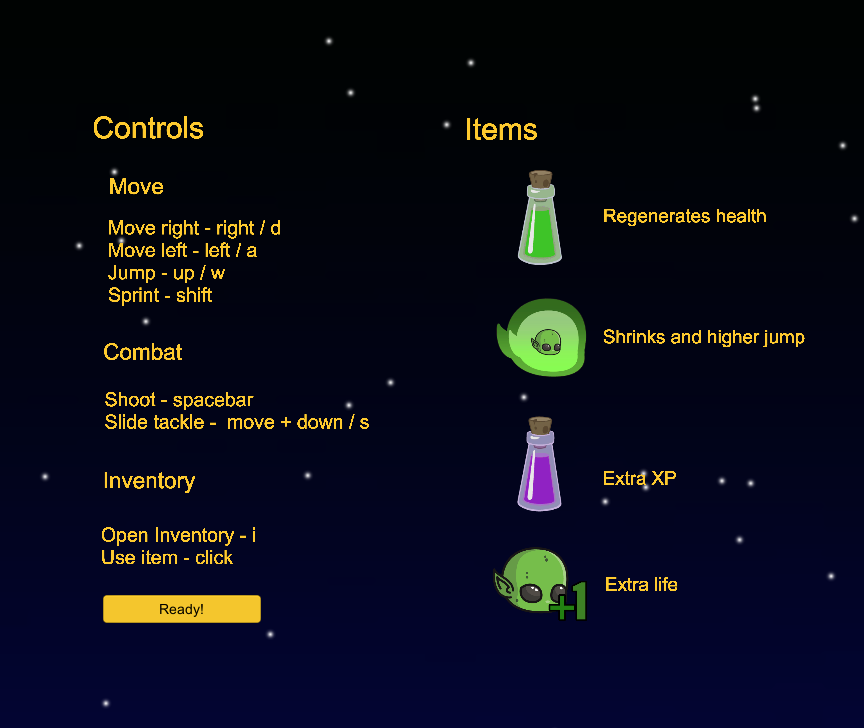

# Fredricks Frontier Game
SE 2250 Final Software Development Project 

### Description of Project
This platform style game was created in Unity. The project focused on using OOP programming skills. I worked on the inventory features, title slides, one level and the pacman style mini game showcased below. The code I worked on for the game can be found in the paths Assets/_Scripts, Assets/Levels/Level1/_Scripts and Assets/Levels/Level1/Minigame folder. Final Grade 90/100. 

#### Title Screen and Menu
On the title screen I set up the rotating planets and the character selections screen that lets the user pick a character who has different power ups and strengths. 

#### Controls
The character can walk, jump, run, slie and shoot weapons. The special items are each programmed to have a special power boost. 

#### Level One
I programmed level one of the game which has a platform style interface. The enemies are made to destory the health of the player and are programmed to jump up and down to catch the player once they try to cross over them.

#### Pacman Game
This was a mini game that pops up after the user finsihes level 1. They need to play this game in order to progress. I built an algorithm so that the ghosts are randomized in their motion and follow the user to increase the difficulty of the game. The characters motion are restricted to the barriers of the maze and they collect the pills to obtain points and win the final game. 

#### Inventory System
The inventory system lets the player select certain power ups that gives them a boost in health, speed or even bonus points throughout the game. 
