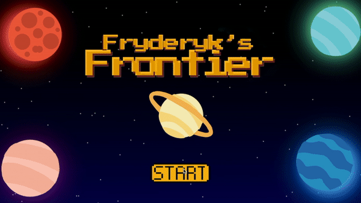
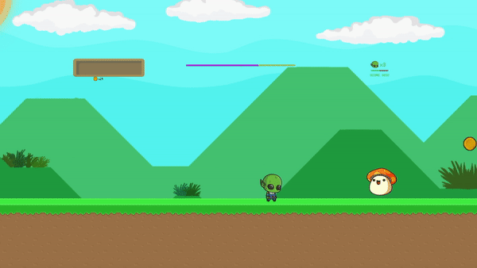
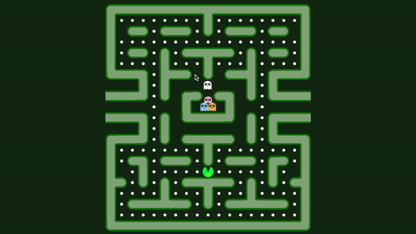
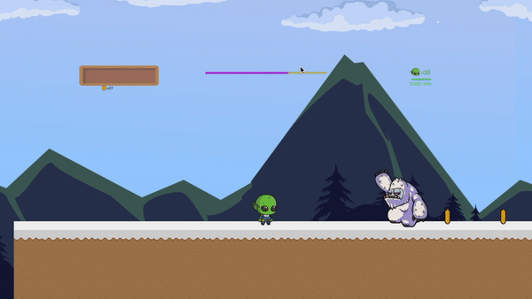

# Fredricks Frontier Game
SE 2250 Final Software Development Project 

### Description of Project
This platform style game was created in Unity and C#. The project focused on using OOP programming skills and implementing the Software Development Lifecycle in a real life project. Final Grade 90/100. 

### Features Worked On
I worked on the title slides, the first level, the pacman style mini game and enemy features as showcased below. The code I worked on for the game can be found in the paths Assets/_Scripts, Assets/Levels/Level1/_Scripts and Assets/Levels/Level1/Minigame folder. 

#### Title Screen and Menu
On the title screen I set up the rotating planets and the character selections screen that lets the user pick a character who has different power ups and strengths.

#### Controls
The character can walk, jump, run, slie and shoot weapons. The special items are each programmed to have a special power boost. 

#### Level One
I programmed level one of the game which has a platform style interface. The enemies are made to destory the health of the player and are programmed to jump up and down.

#### Pacman Game
This was a mini game that pops up after the user finsihes level 1. They need to play this game in order to progress. I built an algorithm so that the ghosts are randomized in their motion and follow the user to increase the difficulty of the game as more pills are collected. The characters motion are restricted to the barriers of the maze and they collect the pills to obtain points and win the final game. 

#### Level Three
In this level I worked on programming the Yeti enemy which shoots snowballs at the alien. The alien loses health when it comes in contact with the Yeti and the snowballs. The Yeti also changes direction either left or right based on the position of the Alien to increase the difficulty. 

